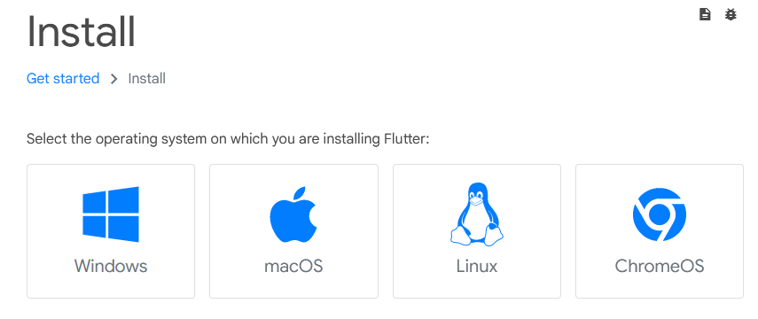
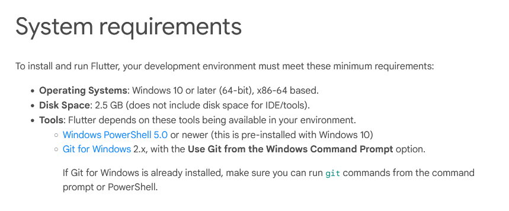
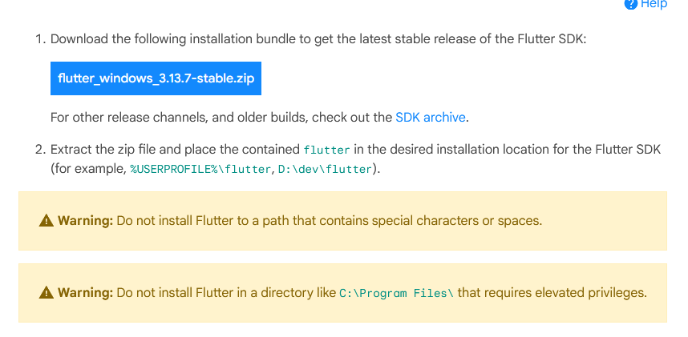
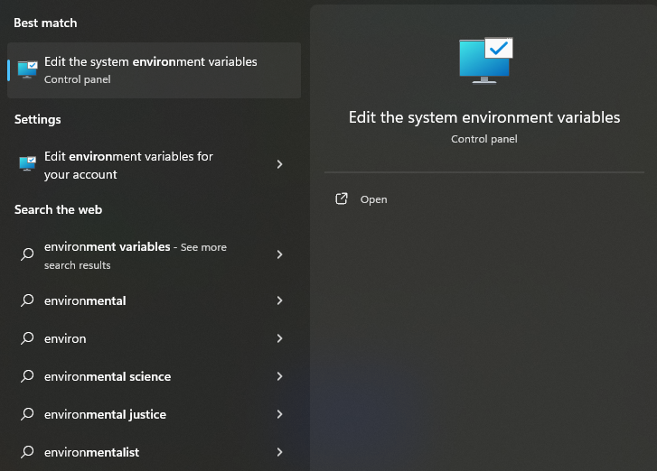
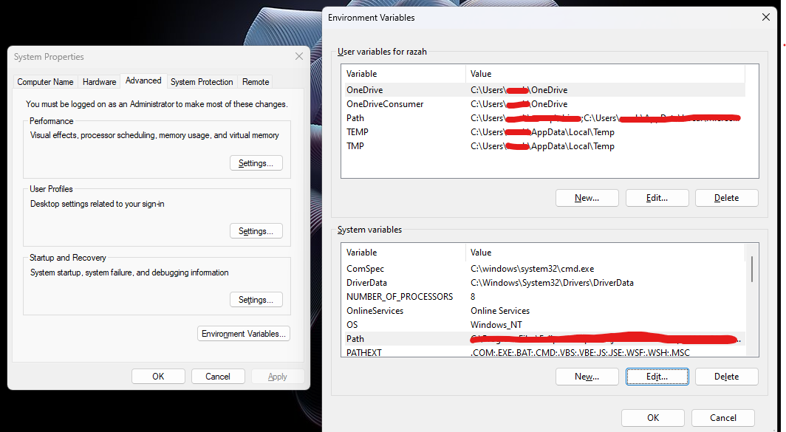
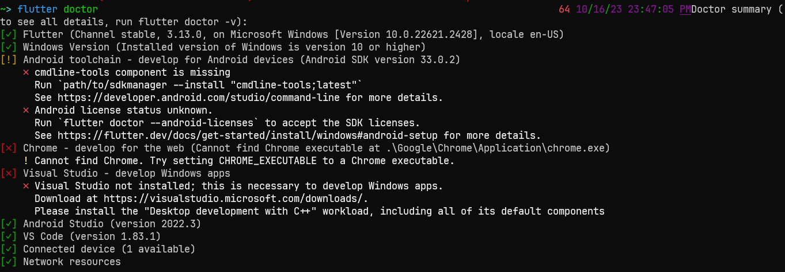
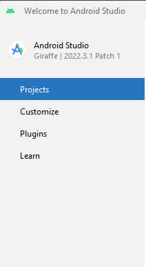
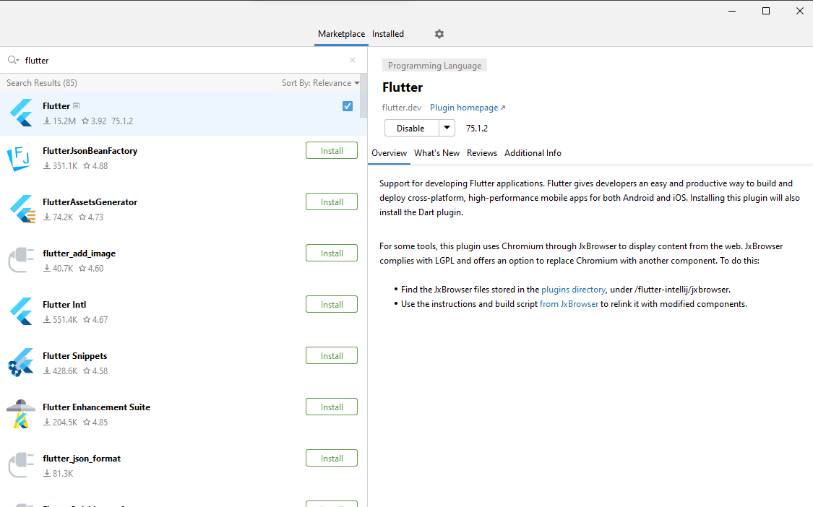

# Installation

> :warning: If you are on a Chromebook, you will not be able to install any of the software listed below. A limited version of Flutter is available on https://dartpad.dev

Below are various tools and programs you need to make mobile apps/follow along with the lectures in Mobile Apps Club. This includes: Android Studio (or Visual Studio Code), Flutter, Android SDK, etc.

Jump to what you need to install: 
- [Android Studio](#installing-android-studio)
- [Flutter](#installing-flutter)

# Installing Android Studio

> :warning: If you are currently using a Desktop provided by the lab, you **do not** need to install **Android Studio** as it is already installed. You can open it by pressing the Windows key and searching for Android Studio.

> :warning: If you want to use Visual Studio Code as your IDE rather than Android Studio, please go to the [installation instructions for VSCode](#installing-visual-studio-code)

> :warning: If you would much rather read the official instructions, go to https://developer.android.com/studio/install

1. Go to https://developer.android.com/studio. This is the download page for Android Studio.

The Android Studio Homepage

2. Click on the **Download** button. As of 2023-15-10, the Android Studio version is Giraffe, so you should click on the **Download Android Studio Giraffe** Button.

> :warning: If for some reason the download button doesn't work, you can scroll down to view the download list with binaries for each operating system:
> 

The Android Studio Downloads section

3. Double-click on the exe that you downloaded or unpack the zip.

4. The Setup Wizard should now open and and a "Welcome to Android Studio" screen should pop up. Simply click **Next**.

Android Studio Setup Wizard Welcome Screen

5. Afterwards, the Setup Wizard will ask you install additional components. These components include the SDK and the Android Virtual Device. The Android SDK is what allows Android Studio to compile and run Android apps. The Android Virtual Device (AVD) is an emulator that emulates an Android device, so you can test your application before publishing. Select **both** and click **Next**.

Android Studio Setup Wizard Components Screen

6. The next screen will ask you where you install Android Studio. The default one should be fine. Click **Install** to begin the installation process. 

Android Studio Setup Wizard Install Screen

7. Once Android Studio has been installed, open it and install the additional components when it asks you to.

8. Once you see the Android Studio logo and a **New Project** button, Android Studio is installed. :tada:

# Installing Flutter

> :warning: If you would much rather read the official instructions, go to https://docs.flutter.dev/get-started/install

1. Go to https://docs.flutter.dev/get-started/install and click on the operating system that you have. If you are using a desktop provided by the lab, simply click on Windows.

Flutter OS page

2. Make sure you meet these requirements. If you do not, please install the tools necessary.

Flutter System Requirements

3. Download the Flutter SDK. Flutter will provide this via a **zip** file. You must extract the zip file and place the folder somewhere safe. Placing the folder in the C: drive is common. 

> :warning: **Please read the warnings listed on the page — for example, do not place your folder within the Program Files folder.**

Flutter SDK zip file

4. **Optional, but HIGHLY RECOMMENDED**: Update your PATH environment variable to include the Flutter CLI. 

- To update your PATH in Windows (google how to do so for MacOS), press the Windows key and search for *"environment variables"*. This should show up: 

Environment Variable Search

- Click on the "Edit the system evironment variables" and once the application opens, click the button that says "Environment Variables" at the bottom. Once you do, the following screen will pop up:

Env. Variables

- Double click on the "Path" variable. This will open up another window where you will see a list of paths. Click on the "New" button and type in the **FULL path** to the **flutter\bin** directory. The flutter folder that you downloaded has a bin directory. For example, I placed my flutter folder inside the C:\ drive so my full path would be C:\flutter\bin.

- This allows you to now run the command `flutter doctor` inside of a terminal. This command is very helpful as it tells you what you do not have installed to run flutter.

- This is an example of what it can show you when you run the command:

"flutter doctor" Example

5. Now, you must download the **Flutter plugin** within your IDE (preferably Android Studio).

6. To download the Flutter plugin in Android Studio, open up Android Studio and click on the Plugins tab.

Plugins Tab

7. Now, search for "Flutter" and install the Flutter plugin. Once you install the plugin, Android Studio will ask you to restart your IDE.

Flutter Plugin

8. You are done! :tada: You can click on the "New Flutter Project" in the Android Studio main menu to create a new flutter project.

