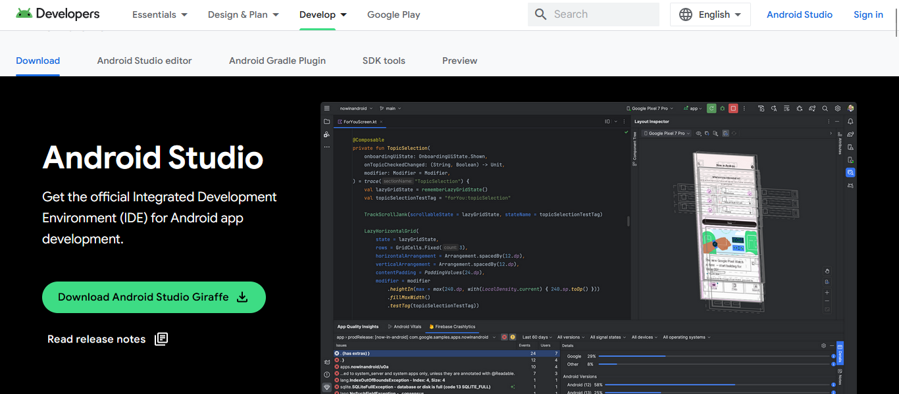
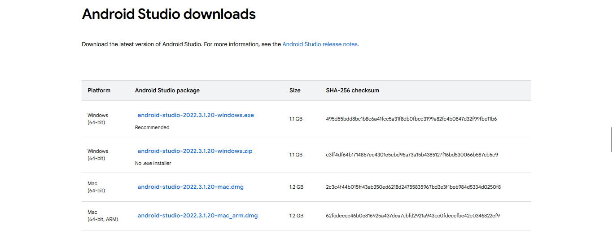
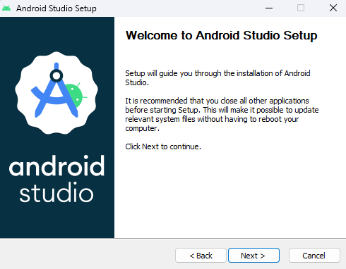
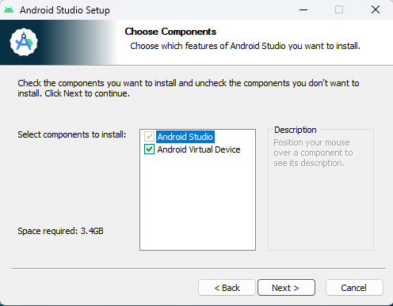
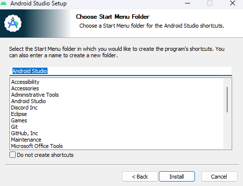

# Installation

Below are various tools and programs you need to make mobile apps/follow along with the lectures in Mobile Apps Club. This includes: Android Studio (or Visual Studio Code), Flutter, Android SDK, etc.

Jump to what you need to install: 
- [Android Studio](#installing-android-studio)

# Installing Android Studio

> :warning: If you are currently using a Desktop provided by the lab, you **do not** need to install **Android Studio** as it is already installed. You can open it by pressing the Windows key and searching for Android Studio.

> :warning: If you want to use Visual Studio Code as your IDE rather than Android Studio, please go to the [installation instructions for VSCode](#installing-visual-studio-code)

> :warning: If you would much rather read the official instructions, go to https://developer.android.com/studio/install

1. Go to https://developer.android.com/studio. This is the download page for Android Studio.

The Android Studio Homepage

2. Click on the **Download** button. As of 2023-15-10, the Android Studio version is Giraffe, so you should click on the **Download Android Studio Giraffe** Button.

> :warning: If for some reason the download button doesn't work, you can scroll down to view the download list with binaries for each operating system:
> 
>  
> 
The Android Studio Downloads section

3. Double-click on the exe that you downloaded or unpack the zip.

4. The Setup Wizard should now open and and a "Welcome to Android Studio" screen should pop up. Simply click **Next**.

Android Studio Setup Wizard Welcome Screen

5. Afterwards, the Setup Wizard will ask you install additional components. These components include the SDK and the Android Virtual Device. The Android SDK is what allows Android Studio to compile and run Android apps. The Android Virtual Device (AVD) is an emulator that emulates an Android device, so you can test your application before publishing. Select **both** and click **Next**.

Android Studio Setup Wizard Components Screen

6. The next screen will ask you where you install Android Studio. The default one should be fine. Click **Install** to begin the installation process. 

Android Studio Setup Wizard Install Screen

7. Once Android Studio has been installed, open it and install the additional components when it asks you to.

8. Once you see the Android Studio logo and a **New Project** button, Android Studio is installed. :tada: